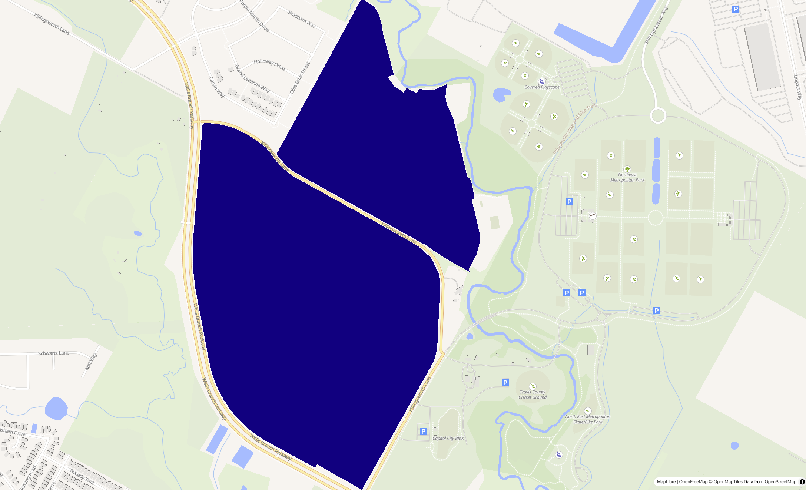
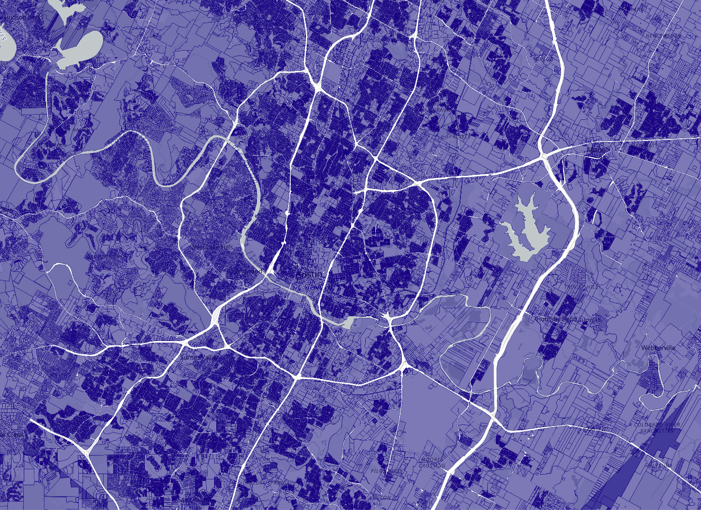
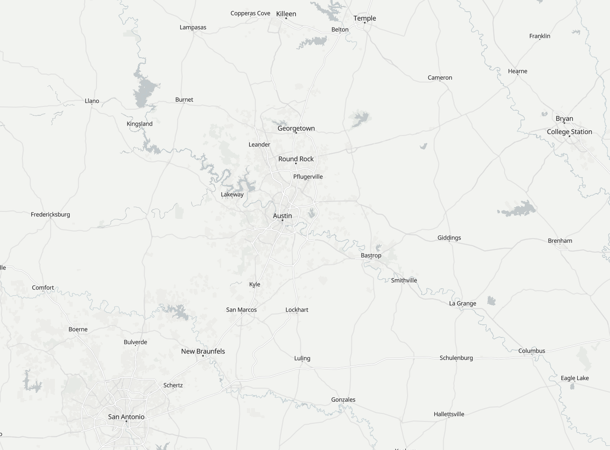
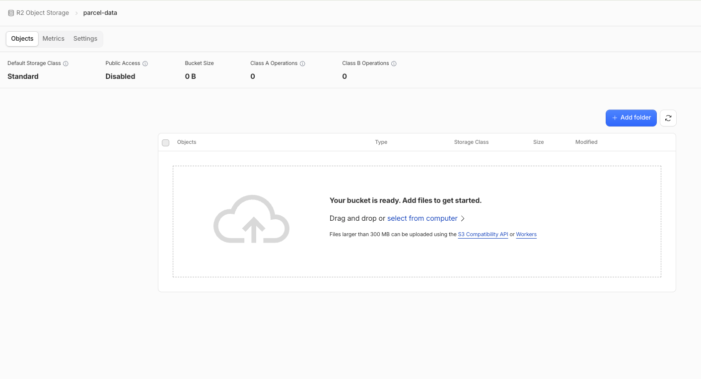
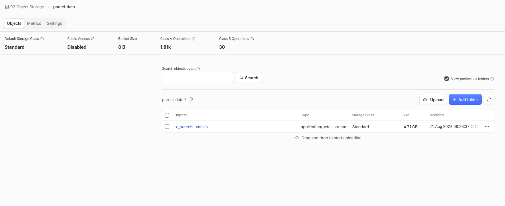

```{r setup, include = FALSE}
knitr::opts_chunk$set(message = FALSE, warning = FALSE)
options(tigris_use_cache = TRUE)
```

If you follow me on any of my social media channels you've likely seen
some of my "mapping millions of data points" posts. A few of these
examples have covered statewide parcel data. In the industries where I
consult - energy/land and real estate - parcel data is immensely
valuable for understanding land ownership, right-of-way, valuation, and
more. There are a tons of challenges in working with parcel data,
however. High-quality parcel data can be expensive or difficult to
access - and even if you get it, you're dealing with huge files that are
challenging to visualize and explore.

In this post, I'll show you how I do it.

## Getting parcel data for Texas

The public availability of parcel GIS data differs widely by state and
by county. Some states, like Texas and Florida, consolidate and
distribute parcel data from counties at the state level and make
state-wide datasets available. Texas is a great example to work with, as
the [Texas Geographic Information Office](https://geographic.texas.gov/)
makes a 2025 statewide parcel dataset available for bulk download. 253
of the state's 254 counties are represented; only Donley County is
missing.

[You can download the data directly from this
link](https://data.geographic.texas.gov/0fa04328-872e-481c-b453-126a74777593/resources/stratmap25-landparcels_48_lp.zip).
It's about 2.6 GB zipped.

Unzipping gets us an Esri file geodatabase a little over 7 GB in size.
This is a hefty spatial dataset to work with, and file geodatabases are
typically meant for use with commercial GIS software. If that's not
available to you, you'll want to use tools for free and file formats
that are more transparent. I'll be using R and DuckDB via the
**duckspatial** package; let's get set up.

With duckspatial, we can use DuckDB's spatial extension to read in our 7
GB file geodatabase lazily and inspect the data quickly.

```{r}
library(duckspatial)
library(tidyverse)

parcels <- ddbs_open_dataset("~/Downloads/stratmap25-landparcels_48.gdb")

parcels |> 
  head(5) |> 
  collect() |> 
  glimpse()
```

There are 38 columns in the dataset that TxGIO has standardized across
Texas's counties. Our first few rows are from Travis County (Austin); we
can see that some of the columns are populated, but others are not (e.g.
year built is missing for these records), so we aren't likely to have
complete coverage for each column across the state.

While DuckDB can read from a file geodatabase directly, let's get our
parcel data into a DuckDB database before proceeding any further.

```{r}
#| eval: false

ddbs_write_dataset(parcels, "~/data/tx_parcels.duckdb", layer = "tx_parcels")
```

## Preparing parcel data for visualization

For a normal spatial dataset, we'd likely spin up a quick interactive
map in R to explore our data. In my mapgl package, the `mapboxgl_view()`
and `maplibre_view()` functions are great for this purpose. For a 14.3
million row, multi-gigabyte dataset, this simply won't work, as it'll
overload your web browser (or possibly even your GIS software) quickly.

Aside from the size issue, there are several other challenges we'll need
to think through before visualizing our data. A few:

-   **Column completeness**. I mentioned this earlier; public statewide
    parcel data will likely have inconsistent or incomplete columns. If
    you try to map data with considerable missingness, it won't be
    informative or will just look bad.

-   **Polygon size**. Parcels are typically very small. On an
    interactive map, it makes little sense to show parcels when zoomed
    out, as you can't actually see most of them, especially within
    cities. So you'll want to figure out a zoom-dependent strategy to
    handle this.

-   **Parcel stacking**. It's common for parcel record datasets to
    include "stacked", or repeated, geometries, as single parcels often
    include multiple records (e.g., a condominium complex with multiple
    owners). This can introduce confusing visual artifacts and obscured
    data.

Resolving all of this will require some decision-making around both data
cleaning and data formats for visualization. We'll first take a look at
our data and see what we can reasonably represent statewide, and come up
with a strategy for the parcel stacking issue.

### Exploring columns in our data

Let's examine column completeness to start with, and see what we might
be able to visualize. Most missing data in the dataset (as we saw above)
is a blank string, not `NA`, so we'll evaluate accordingly.

```{r}
library(scales)

parcels <- ddbs_open_dataset("~/data/tx_parcels.duckdb", layer = "tx_parcels")

completeness <- parcels |>
  ddbs_drop_geometry() |>
  summarize(across(
    everything(),
    ~ mean(as.numeric(!is.na(.x) & trimws(as.character(.x)) != ""), na.rm = TRUE)
  )) |>
  collect() |>
  pivot_longer(everything(), names_to = "column", values_to = "share_filled")

ggplot(completeness, aes(x = share_filled, y = reorder(column, share_filled))) +
  geom_col(fill = "#1e3a8a") +
  scale_x_continuous(labels = label_percent()) +
  labs(x = "Share of parcels with a non-blank value", y = NULL) +
  theme_minimal(base_size = 11) +
  theme(panel.grid.major.y = element_blank())
```

Some columns are clear no-gos for statewide analysis; for example, we
only have a little over 50% coverage for year built and land use.
Ownership is mostly complete, as are the value columns (market, land,
and improvement). However, this can be misleading. Let's take a closer
look at the value columns:\

```{r}
zero_shares <- parcels |>
  ddbs_drop_geometry() |>
  summarize(across(
    c(MKT_VALUE, LAND_VALUE, IMP_VALUE),
    ~ mean(
      as.numeric(try(as.numeric(regexp_replace(.x, "[$, ]", "", "g"))) == 0),
      na.rm = TRUE
    )
  )) |>
  collect() |>
  pivot_longer(everything(), names_to = "column", values_to = "share_zero")

zero_shares
```

20 percent of the market value, 30 percent of the land value, and 56
percent of the improvement value columns are zero! So if we tried to
visualize any of these columns, we'd be dealing with substantial
coverage gaps. Beyond this, though, the zero-values likely mean
substantively different things. A "0" improvement value may actually be
meaningful, as vacant land won't have improvements on it. However, in
many cases, the "0" is also representing missing data here. So we have
to proceed with caution, and really shouldn't visualize the data
statewide.

So we need to figure out what we *can* show. Ownership is often one of
the most interesting parcel characteristics for energy / land / real
estate clients. A compelling map might be a visualization of non-Texas
ownership; specifically parcels where the listed owner is either in
another state or international. Let's take a quick look:

```{r}
parcels |>
  ddbs_drop_geometry() |>
  count(MAIL_STAT, sort = TRUE) |>
  head(10) |>
  collect()
```

Around 11.7 million parcels list an owner in Texas; another 1.27 million
are blank (though most of these are in Tarrant County, where "TX" is
appended to the city in the data); and another 620,000 list "TEXAS".
Other states are well-represented, notably over 150k in California.

This does suggest an interesting map idea: the geography of out-of-state
owners. We'll come back to this when it's time to prep the data for
visualization.

### Dealing with parcel stacking

Our next data wrangling step is handling the parcel stacking issue -
duplicate geometries in our data that represent separate parcel records.
Let's first diagnose the issue. The geometry column is named `SHAPE` in
this dataset, so we can use that as a unique identifier in our
diagnosis.

```{r}
parcels |>
  count(SHAPE) |>
  summarize(
    parcels = n(),
    stacked_parcels = sum(as.numeric(n > 1), na.rm = TRUE),
    records_in_stacks = sum(if_else(n > 1, n, 0), na.rm = TRUE),
    largest_stack = max(n, na.rm = TRUE)
  ) |>
  collect()
```

Of the 14.3 million parcel records, we have around 13.5 million unique
shapes. Around 932,000 records are in stacked parcels; the largest stack
has over 11,300 records! Let's take a look at the biggest stacks:

```{r}
parcels |>
  group_by(SHAPE) |>
  summarize(
    records = n(),
    accounts = n_distinct(Prop_ID),
    owners = n_distinct(OWNER_NAME),
    counties = n_distinct(COUNTY),
    .groups = "drop"
  ) |>
  filter(records > 1000) |>
  mutate(missing_geometry = is.na(SHAPE)) |>
  select(-SHAPE) |>
  collect()
```

The biggest "stack" actually represents all parcel records that don't
have geometry. The other example - a parcel with 1210 records and 1083
owners - is a manufactured home community in Pflugerville, outside
Austin. Each of the records represents a single mobile-home space but
they all share the same parcel. For example:

```{r}
library(sf)

boulder_ridge <- parcels |> 
  filter(COUNTY == "TRAVIS", Prop_ID == "702976") |> 
  collect() 

boulder_ridge
```

But when we map it:

```{r}
#| eval: false
library(mapgl)

maplibre_view(boulder_ridge, style = openfreemap_style("liberty"))
```



You can see the issue in the map; `maplibre_view()` typically shows
shapes as semi-transparent, but the "stacking" renders the shape fully
opaque.

We'll need to clean this up, ideally retaining as much information from
the stacks as possible.

```{r}
parcels_clean <- parcels |>
  filter(!is.na(SHAPE)) |>
  mutate(
    owner = na_if(trimws(OWNER_NAME), ""),
    value = nullif(try(as.numeric(regexp_replace(MKT_VALUE, "[$, ]", "", "g"))), 0),
    st = toupper(trimws(MAIL_STAT)),
    city_st = regexp_extract(toupper(MAIL_CITY), ",\\s*([A-Z]{2})\\s*$", 1L),
    mail_city = na_if(trimws(MAIL_CITY), ""),
    owner_origin = case_when(
      st %in% c("TX", "TEXAS") | city_st == "TX" ~ "Texas owner",
      st == "" & city_st == "" ~ "Unknown",
      TRUE ~ "Out-of-state owner"
    ),
    owner_location = case_when(
      city_st != "" ~ mail_city,
      !is.na(mail_city) & st != "" ~ paste0(mail_city, ", ", st),
      st != "" ~ st,
      TRUE ~ NA
    ),
    situs = if_else(regexp_matches(SITUS_ADDR, "[A-Za-z0-9]"), trimws(SITUS_ADDR), NA)
  ) |>
  group_by(SHAPE, Prop_ID) |>
  summarize(
    owners_list = list_distinct(array_agg(owner)),
    owner_rep = min(owner, na.rm = TRUE),
    owner_origin = mode(owner_origin),
    owner_location = arg_min(owner_location, owner),
    value = max(value, na.rm = TRUE),
    situs_addr = min(situs, na.rm = TRUE),
    county = min(COUNTY, na.rm = TRUE),
    .groups = "drop_last"
  ) |>
  summarize(
    accounts = n(),
    owners_all = list_sort(list_distinct(flatten(array_agg(owners_list)))),
    owner_origin = mode(owner_origin),
    owner_location = arg_min(owner_location, owner_rep),
    situs_addr = min(situs_addr, na.rm = TRUE),
    county = min(county, na.rm = TRUE),
    total_value = sum(value, na.rm = TRUE),
    .groups = "drop"
  ) |>
  mutate(
    n_owners = len(owners_all),
    owner_names = array_to_string(list_slice(owners_all, 1L, 3L), "; "),
    stacked = as.integer(accounts > 1)
  ) |>
  as_duckspatial_df(crs = 3857, geom_col = "SHAPE")

```

It's worth talking through the code a bit here:

-   We first do some wrangling inside the database to identify Texas and
    non-Texas owners, and clean up areas where we have data missingness
    (e.g. converting true blanks to `NA` in the address column).

-   We'll then summarize twice over parcels grouped by their geometry
    and property ID. The first summarize collapses ownership records
    into tax accounts; the second collapses tax accounts into specific
    parcel geometries, collecting metadata along the way.

-   Handling owner information without losing anything is tricky, as
    we'll in some cases have to condense 100s of owners into a single
    row of our dataset. We'll do a couple things here: create an
    `owners_all` column that handles all of the owners, then an
    `owner_names` column that shows the first few owners in a
    multi-owner parcel.

-   Given that we grouped by the `SHAPE` column (the warning message we
    get), `as_duckspatial_df()` reconstructs the geometry for us, which
    we'll need in the next step.

## Preparing the data for visualization with freestiler

We've handled column inspection and wrangled our data. Now, we'll need
to iron out the visualization issues. Even though we've cleaned up the
stacked geometry, we still have 13.5 million unique polygons to
visualize... which is way too many to load directly into a modern web
map.

The solution is to convert to *vector tiles*, which is the format Google
Maps, Mapbox, and other modern web mapping providers use to visualize
millions of data points. We'll be using **freestiler** to do this, a
tool I developed earlier this year to build vector tiles directly from
your data.

Let's first write our data from R to a file to save our progress. We'll
be writing to a Parquet file, which is an excellent format for storing
large datasets - including geospatial ones - in efficient ways. We'll
need to drop the `owners_all` column first, which is in a format that
our vector tiles won't work well with.

```{r}
#| eval: false
parcels_clean |>
  select(-owners_all) |>
  ddbs_transform("EPSG:4326") |>
  ddbs_write_dataset("~/data/tx_parcels_tiles.parquet", overwrite = TRUE)
```

I built freestiler for speed and interoperability. freestiler can tile
directly from an R or Python spatial object; a DuckDB database or query;
or even a file on disk, like a Parquet file. Its backend is written in
Rust for speed. We're choosing Parquet here to avoid reading the full
dataset into R and to have an intermediate data artifact pre-tiling. The
function to generate tiles from a file is `freestile_file()`; the output
is a PMTiles file, a single file that stores all of the data as vector
tiles.

```{r}
#| eval: false
library(freestiler)

freestile_file(
  "~/data/tx_parcels_tiles.parquet",
  output = "~/data/tx_parcels.pmtiles",
  layer_name = "parcels",
  min_zoom = 10,
  max_zoom = 14
)
```

In my test run, the tiling itself took around 5 minutes. In the call to
`freestile_file()`, note the min zoom and max zoom. Individual parcels
don't really show up visually past zoom level 10 anyway, so there really
isn't need to make them available at smaller zooms. The max zoom of 14
simply has to do with level of detail; parcels will remain visible past
zoom 14 due to overzooming.

To view the tiles, we'll need a local tile server that supports HTTP
range requests. The `view_tiles()` function in freestiler will spin up a
local server to handle this, but doesn't work well with tilesets larger
than 1GB. To view our large tileset, let's start a local server, then
use mapgl's `add_pmtiles_source()`.

In a terminal, I recommend installing node's `http-server`:

```         
npm install --global http-server
```

Then, `cd` into the folder that contains your tileset, and type in your
terminal:

```         
http-server -p 8002 --cors
```

You can pick whatever port you want, but make sure to use the `--cors`
flag to allow for cross-origin requests. We can now view our tiles on a
simple map:

```{r}
#| eval: false
maplibre(
  style = openfreemap_style("positron"),
  center = c(-97.74, 30.27),
  zoom = 11
) |>
  add_pmtiles_source(
    id = "parcel-tiles",
    url = "http://localhost:8002/tx_parcels.pmtiles"
  ) |>
  add_fill_layer(
    id = "parcels",
    source = "parcel-tiles",
    source_layer = "parcels",
    fill_color = "navy",
    fill_opacity = 0.5
  )

```



Parcels render fast and crisp due to quite a bit of internal
optimization freestiler does under the hood to make it possible.
However, we haven't yet solved the last problem fully - zooming out. Our
tiles start at zoom 10, so when you zoom out, you'll see a blank map:



We'll want to fill that space, but fortunately R and mapgl make that
straightforward.

## Mapping ownership in Texas by parcel

Let's finish building out the map into something that visualizes
ownership in Texas without gaps. We can pull in county geometries with
the R tigris package - but since we have county information in the
parcel data, let's use our DuckDB database to calculate some interesting
stats, and merge that in to the counties so we can show information when
the map is zoomed out.

In the code block below, we'll parse the owners in the parcel data, then
roll up that information to the county level and pull that information
into R.

```{r}
county_stats <- parcels |>
  ddbs_drop_geometry() |>
  mutate(
    owner = na_if(trimws(OWNER_NAME), ""),
    st = toupper(trimws(MAIL_STAT)),
    city_st = regexp_extract(toupper(MAIL_CITY), ",\\s*([A-Z]{2})\\s*$", 1L),
    owner_origin = case_when(
      st %in% c("TX", "TEXAS") | city_st == "TX" ~ "Texas owner",
      st == "" & city_st == "" ~ "Unknown",
      TRUE ~ "Out-of-state owner"
    )
  ) |>
  group_by(COUNTY) |>
  summarize(
    parcel_records = n(),
    unique_owners = n_distinct(owner),
    out_of_state = sum(as.numeric(owner_origin == "Out-of-state owner"), na.rm = TRUE)
  ) |>
  collect() |>
  mutate(pct_out_of_state = round(100 * out_of_state / parcel_records, 1)) |> 
  arrange(desc(pct_out_of_state))

county_stats
```

We notice the counties with the largest shares of out-of-state ownership
are typically smaller counties in West Texas; the exception is Travis
County, where nearly 1 in 5 parcels are externally owned.

We'll now grab county geometry from tigris and merge in our tabulated
data.

```{r}
library(tigris)

tx_counties <- counties("TX", cb = TRUE) |>
  mutate(county_key = toupper(NAME)) |>
  left_join(county_stats, by = c("county_key" = "COUNTY"))
```

With our county data in hand, we'll build out the map with the mapgl
package. mapgl allows you to stack and compose layers using R; it may
take a few lines of code to get what you want, but mapgl exposes quite a
bit of the Mapbox / MapLibre APIs. Here's our mapping code, with some
notes to follow:\

```{r}
#| eval: false
library(mapgl)

ownership_colors <- c(
  "Texas owner" = "#3b5bdb",
  "Out-of-state owner" = "#ea580c",
  "Unknown" = "#94a3b8"
)

parcel_popup <- concat(
  "<strong>", get_column("owner_names"), "</strong><br>",
  "Owners: ", get_column("n_owners"),
  " | Tax accounts: ", get_column("accounts"), "<br>",
  if_else_expr(
    is_blank("situs_addr"),
    "",
    concat(get_column("situs_addr"), "<br>")
  ),
  "Owner location: ",
  if_else_expr(
    is_blank("owner_location"),
    "Not listed",
    get_column("owner_location")
  ),
  "<br>",
  get_column("county"), " County<br>",
  if_else_expr(
    is_blank("total_value"),
    "No market value reported",
    concat(
      "Total value: ",
      mapgl::number_format(
        "total_value",
        style = "currency",
        currency = "USD",
        maximum_fraction_digits = 0
      )
    )
  )
)

maplibre(
  style = openfreemap_style("positron"),
  center = c(-97.74, 30.27),
  zoom = 11
) |> 
  add_pmtiles_source(
    id = "parcel-tiles",
    url = "http://localhost:8002/tx_parcels.pmtiles"
  ) |> 
  add_fill_layer(
    id = "parcels",
    source = "parcel-tiles",
    source_layer = "parcels",
    fill_color = match_expr(
      column = "owner_origin",
      values = names(ownership_colors),
      stops = unname(ownership_colors),
      default = "#94a3b8"
    ),
    fill_opacity = 0.5,
    popup = parcel_popup,
    hover_options = list(fill_opacity = 0.9)
  ) |> 
  add_fill_layer(
    id = "counties",
    source = tx_counties,
    fill_color = interpolate(
      column = "pct_out_of_state",
      values = c(0, 40),
      stops = c("#fff7ed", "#7c2d12"),
      na_color = "#e5e7eb"
    ),
    fill_opacity = interpolate(
      property = "zoom",
      values = c(10, 11),
      stops = c(0.85, 0)
    ),
    max_zoom = 11,
    popup = "<strong>{NAME} County</strong><br>
             Parcel records: {parcel_records}<br>
             Unique owners: {unique_owners}<br>
             Out-of-state owners: {pct_out_of_state}%"
  ) |> 
  add_line_layer(
    id = "county-borders",
    source = tx_counties,
    line_color = "#7c2d12",
    line_width = 0.5,
    line_opacity = interpolate(
      property = "zoom",
      values = c(10, 11),
      stops = c(0.6, 0)
    ),
    max_zoom = 11
  ) |> 
  add_legend(
    legend_title = "Share of out-of-state owners",
    type = "continuous",
    values = c("0%", "40%+"),
    colors = c("#fff7ed", "#7c2d12"),
    max_zoom = 10
  ) |>
  add_legend(
    legend_title = "Parcel ownership",
    type = "categorical",
    values = names(ownership_colors),
    colors = unname(ownership_colors),
    min_zoom = 10, 
    add = TRUE
  )
```

I've written extensively about mapgl elsewhere (including on this blog),
but a few features of note here.

-   We interpolate the county fill opacity on zoom intentionally between
    zoom levels 10 and 11; this creates a "fade away" effect where the
    counties fade away to parcels as the user zooms in. We'll do this
    both for county fill and county borders (as line widths for fill
    layers aren't configurable).

-   There are a lot of different ways to configure popups in mapgl, but
    one relatively new feature I've added is the ability to pass columns
    directly to popups with `{column}` syntax inside the popup string.

-   The parcel popup is set up a different way, using an overhaul to the
    popup engine I've introduced that allows for conditional popups.
    This is important for building highly customized popups that will
    differ based on the data in a given location.

-   I just added a new feature to mapgl that allows you to show and hide
    different legends on zoom with `min_zoom` and `max_zoom` arguments.
    So you'll need to make sure you have the latest version of mapgl
    (either from GitHub or R-Universe) to use this.

We have a map! And there's a lot to explore. In Travis County, for
example, you can find a lot of areas that have out-of-state owners,
particularly around commercial corridors and on investor-owned land.


Around the state, you'll still see some quirks of parcel data show up.
Even though we consolidated duplicate geometries, you'll still see areas
with *overlapping* geometries. Data missingness is also an issue; for
example, no parcels in Travis County carry the city name for their
addresses.

The map is great - but it's just running locally on my machine. You
can't save this out - it's a mapping equivalent of the joke "take a look
at my project, it's at http://localhost:8002". So we'll need to find
somewhere to host the PMTiles so we can actually share the
visualization.

## Hosting PMTiles on Cloudflare R2

Per the [PMTiles
documentation](https://docs.protomaps.com/pmtiles/cloud-storage),

> PMTiles is designed to work on any S3-compatible cloud storage
> platform that supports HTTP Range Requests. Proper support for
> Cross-Origin Resource Sharing is required if your map frontend is
> hosted on a different domain than your storage platform.

That may not mean a lot to you if you're used to visualizing data
locally on your computer. Basically, we can host our data on any number
of popular cloud storage platforms (Google Cloud, Amazon S3, Microsoft
Azure) so long as we configure it correctly for that specific provider.
The easiest way to host PMTiles in my opinion is on GitHub Pages, which
does support range requests; however, our PMTiles file is 4.7 GB in size
and too large for that option. So we'll want to upload to a cloud
storage bucket.

My provider of choice is [Cloudflare
R2](https://www.cloudflare.com/products/r2/). It's quite affordable and
has zero egress fees, which means you don't have to pay for data
transfer out to the internet. Plus, if you connect a custom domain to
your bucket (which you can buy through Cloudflare easily), you can use a
Worker to benefit from Cloudflare's edge caching (making it quite fast
to load once set up). I'll just show the simplest setup here.

To get started, you will need [to sign up for a Cloudflare
account](https://dash.cloudflare.com/sign-up), if you don't have one
already. You can use OAuth with Google, Apple, or GitHub, so it's pretty
painless. In the left-hand menu once you're in, navigate to **Storage &
databases** \> **R2 Object Storage**. You will need to put in a credit
card at this stage, but you get 10GB/month hosting for free, which means
that our PMTiles will sit comfortably within the free tier.

Once you're in, look for the blue button that says **Create bucket** to
create your first bucket. I'm naming my bucket `parcel-data`, but you
can name yours whatever you want. Keep the other options as they are,
then choose **Create bucket**. You'll be taken to your bucket's screen.



Note that you can drag-and-drop files smaller than 300MB into your
bucket. For more contained PMTiles files, this is a nice option.
However, our data is too big to drag-and-drop, so we'll need to use the
S3 Compatibility API. Fortunately, another one of my R packages,
**pmtiles**, makes this straightforward.

The pmtiles package wraps the [pmtiles
CLI](https://docs.protomaps.com/pmtiles/cli), which includes a variety
of utilities for working with PMTiles files. One very useful utility is
`pmtiles upload` which helps you upload your PMTiles files to cloud
storage. In the R package, the wrapper function is `pm_upload()`.

You'll first need to grab a couple keys to access your bucket. Head back
to the main R2 Object Storage page in Cloudflare, and look at the
lower-right of the screen; you'll see a button that says "Manage API
Tokens." Click there. Create a User API token. Give it a name, set the
Permissions to "Object Read and Write," and scope it to your specific
bucket. Keep the other options as they are, then scroll down and create
the token.

Copy and securely store your Access Key ID and Secret Access Key; you
won't be able to see these values again. I'd recommend putting them in
your `.Renviron` file, which you can edit with
`usethis::edit_r_environ()`. I'll store mine as two lines in
`.Renviron`: `CLOUDFLARE_PARCELS_KEY` and `CLOUDFLARE_PARCELS_SECRET`.

With these credentials in hand, we can use `pm_upload()` to move our
data to our bucket. You'll need one more value: your Cloudflare account
ID, which is in the same Account Details panel on the R2 Object Storage
page where you found the Manage API Tokens button.

The `r2_bucket()` helper in the pmtiles package takes it from there.
R2's S3-compatible API has some fiddly requirements - a specific URL
format, a required `region=auto` parameter - and the helper assembles
all of this correctly from just your bucket name and account ID. Your
credentials are passed along to the upload process only, so they never
get written into your R session's environment variables. (There are
companion helpers for other providers, too: `s3_bucket()`,
`gcs_bucket()`, `azure_bucket()`, and `s3_compatible_bucket()`.) Let's
upload the tiles to our bucket:\

```{r}
#| eval: false
library(pmtiles)

pm_upload(
  "~/data/tx_parcels.pmtiles",
  remote = "tx_parcels.pmtiles",
  bucket = r2_bucket(
    "parcel-data",
    account_id = "your-cloudflare-account-id",
    access_key = Sys.getenv("CLOUDFLARE_PARCELS_KEY"),
    secret_key = Sys.getenv("CLOUDFLARE_PARCELS_SECRET")
  )
)

```

If your tiles have uploaded successfully you'll get a success message in
R. Head back to Cloudflare R2 in your web browser and you should see
them there.



Now, click the Settings tab. As I mentioned earlier, if you want to
deploy your data "in production" - so for a work project, or for a wide
audience - you'll want to connect a custom domain. I have a couple
domains through Cloudflare that I use, and tile performance is just as
fast as when I serve it on my local computer (example:
https://walker-data.com/freestiler/lodes). I'll show you here the
quickest way (but not the highest-performance way) to share your tiles.
Enable the Public Development URL - you'll get a warning that this will
be lower-performance than using a custom domain. Next, set the CORS
policy, so your tiles can be viewed in a web map not hosted at the same
domain. The CORS policy you want is this (with one caveat):

```         
[
  {
    "AllowedOrigins": ["*"],
    "AllowedMethods": ["GET", "HEAD"],
    "AllowedHeaders": ["range", "if-match"],
    "ExposeHeaders": ["etag", "content-range", "content-length"],
    "MaxAgeSeconds": 3600
  }
]
```

Using this block will allow *any* origin to access your tiles. If you're
building your maps into arbitrary projects (local work in R / Positron,
various Shiny apps, etc.) this is probably what you want. However, if
you do plan to share your work in a public map (and don't want to set up
a custom domain) then you might consider locking it to your site's
origin (e.g. https://walker-data.com for me).

Your PMTiles will now be accessible at
`{YOUR_PUBLIC_DEVELOPMENT_URL}/tx_parcels.pmtiles}`, and can be used in
`add_pmtiles_source()`.

## Sharing your map

With the Cloudflare setup ready to go, you'll now be able to share your
map. Use the mapping code I shared above, but swap in your deployed
PMTiles URL in place of the localhost one. You should be able to see the
hosted tiles in R. To share your map with others, here's what I
recommend doing:

-   Assign your map to a variable (e.g. `m1`) then write it out to disk
    as an HTML file with `htmlwidgets::saveWidget()`. If you want a
    single-file map use `selfcontained = TRUE`; I'll recommend
    `selfcontained = FALSE` to keep your HTML smaller (just remember to
    move the directory together, not just the file).

```{r}
#| eval: false

m1 <- maplibre(
  style = openfreemap_style("positron"),
  center = c(-97.74, 30.27),
  zoom = 11
) |> 
  add_pmtiles_source(
    id = "parcel-tiles",
    url = "YOUR_R2_PMTILES_URL"
  ) |> 
  # the rest of the mapping code follows here

htmlwidgets::saveWidget(m1, "/path/to/your/directory/index.html", selfcontained = FALSE)
```

-   Publish your map and mapping assets to your web server of choice. I
    like to use GitHub Pages; I host most of my websites there because
    it's easy to version control my web content with git.

My live map is now available at
https://walker-data.com/maps/texas-parcel-owners:

```{=html}
<iframe width="100%" height="600" src="https://walker-data.com/maps/texas-parcel-owners" title="Texas parcels by owner origin" frameborder="0" allow="fullscreen" loading="lazy" style="border: 1px solid #e2e8f0; border-radius: 6px;"></iframe>
```

We've now gone end to end: downloading a 7GB geodatabase from TxGIO and
visualizing those millions of parcels on a map. This tech stack (R,
DuckDB, freestiler, pmtiles, and mapgl) is the same one I use in most of
my projects.

One of the most important take-aways for me is not the impressive
end-product but rather the series of decisions you need to make to get
there. We had to figure out inconsistencies and missingness in our
dataset, we had to come up with a solution for the stacked parcel
problem, and we had to decide which data we were comfortable with
collapsing / consolidating. These are all human decision points that are
highly relevant to actual applications of this workflow, e.g. in
investment, land acquisition, or right-of-way analyses. You can offload
that stuff to your agent I suppose, but people who inject human
expertise there are going to stand out.

Everything here transfers to your own projects, too. Florida and New
York publish statewide parcel files that work with this exact pipeline,
and the same pattern applies to any other massive spatial dataset you
need to get on a map. Swap in your data source, make your own cleaning
decisions, and keep the plumbing.

Finally - if your team works with parcel, ownership, or land data and
wants to build workflows like this, this is exactly what I do. Reach out
to [kyle\@walker-data.com](mailto:kyle@walker-data.com) to discuss your
idea. And if you make something with this stack, let me know what you
create!