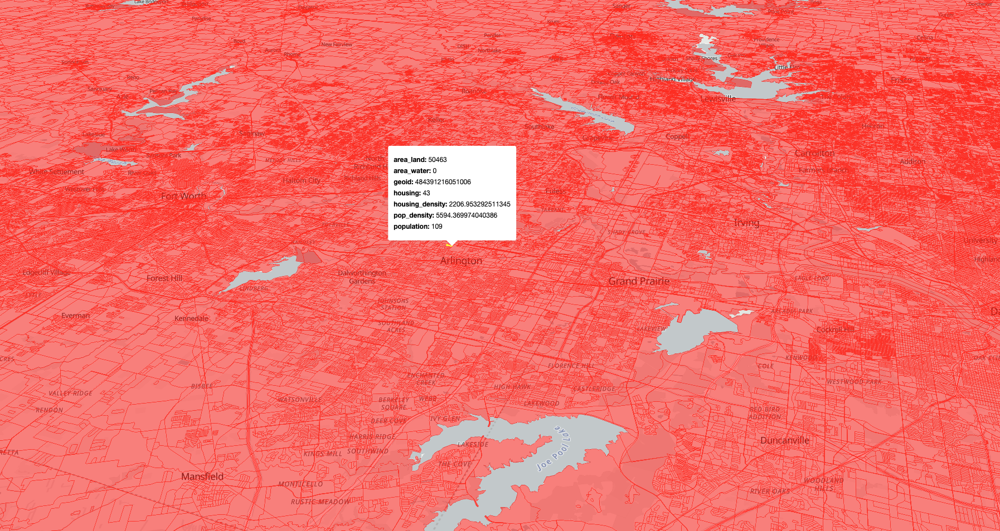
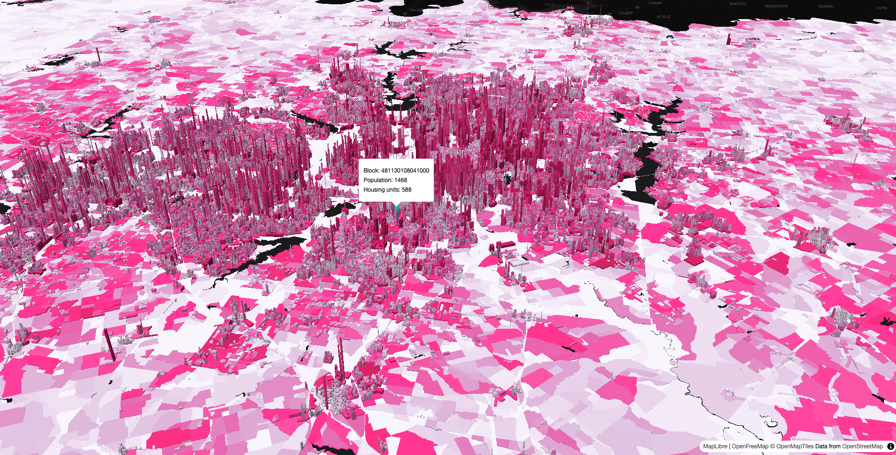

```{r setup, include = FALSE}
knitr::opts_chunk$set(message = FALSE, warning = FALSE)
options(tigris_use_cache = TRUE)
```

I've been working on the [mapgl R
package](https://walker-data.com/mapgl) for the past year which brings
high-performance WebGL mapping to R users. While Mapbox and MapLibre are
impressive libraries, the traditional way mapgl visualizes vector
datasets - as GeoJSON sources - runs into bottlenecks with very large
datasets. If you are dealing with millions of points, or hundreds of
thousands of polygons, your map may render slowly (or not render at
all).

In these instances, I've had a lot of success with
[PMTiles](https://docs.protomaps.com/pmtiles/). PMTiles is a single-file
archive format for tiled map data that can transform your work with
large geospatial data visualization. I'm using PMTiles to visualize
millions of features in production mapping applications quickly and
efficiently.

This is the first of a three-post series that steps you through the
process of working with PMTiles in your mapping applications. In this
post, I'll introduce you to my brand-new [**pmtiles** R
package](https://github.com/walkerke/pmtiles), which provides an R
wrapper for the [PMTiles command-line
tool](https://github.com/protomaps/go-pmtiles) along with some other
utilities for creating and viewing PMTiles. I'll show you how to map all
655,000+ Census blocks in Texas - complete with 3D extrusion, hover
effects, and tooltips - all locally on your computer.

The second and third posts in this series will focus on moving PMTiles
workflows to production. In the second post, I'll walk you through how
to deploy your PMTiles to Cloudflare R2 so you can share your maps with
the world. In the third post, I'll show you how to integrate your tiles
into a Shiny web mapping application and deploy your app for production
use.

## Getting Census block data with tigris

Let's start by grabbing Census block boundaries for Texas using the
**tigris** package. Census blocks are the smallest geographic unit
published by the Census Bureau - and Texas has more of them than any
other state.

```{r}
#| eval: false

library(tigris)
library(dplyr)
library(pmtiles)
library(mapgl)
library(sf)
options(tigris_use_cache = TRUE)

tx_blocks <- blocks(state = "TX", year = 2024)

nrow(tx_blocks)
```

We've got 668,757 blocks. That's a lot of polygons to visualize on a
map!

Let's clean up the data a bit. We'll select the columns we care about,
filter out water-only blocks, and calculate some derived measures like
population density.

```{r}
#| eval: false

tx_blocks_cleaned <- tx_blocks |>
  select(
    geoid = GEOID20,
    area_land = ALAND20,
    area_water = AWATER20,
    housing = HOUSING20,
    population = POP20
  ) |>
  filter(area_land > 0) |>
  mutate(
    pop_density = population / (area_land / 2589988),
    housing_density = housing / (area_land / 2589988)
  )

nrow(tx_blocks_cleaned)
```

After removing water-only blocks, we're down to 655,142 blocks. Still a
massive dataset to visualize!

## Creating PMTiles with pm_create()

The **pmtiles** package includes `pm_create()`, which wraps the
[tippecanoe](https://github.com/felt/tippecanoe) tool for creating
high-quality tiled map archives. You'll need to install tippecanoe
separately (on macOS: `brew install tippecanoe`; see the [package
README](https://github.com/walkerke/pmtiles) for other platforms).

The *simplest* way to create a tileset is to specify an input dataset
and output PMTiles file, then let tippecanoe choose the rest of the
arguments.

```{r}
#| eval: false

pm_create(tx_blocks_cleaned, "tx_blocks_default.pmtiles")
```

`pm_create()` works directly with sf objects and handles all the
complexity of tile generation behind the scenes. tippecanoe needs to
process all of the Census blocks into tiles, so this process may take a
few minutes to complete. When your tiles are ready, you can preview them
with `pm_view()`:

```{r}
#| eval: false

pm_view("tx_blocks_default.pmtiles")
```


We notice that the data can be explored very quickly, but the blocks are
very choppy when zoomed out. This is because the default options for
tippecanoe are optimizing the tileset for display and performance;
you'll notice that all blocks become fully formed when you zoom in.

In many cases, this configuration may be fine. [In another post, I
discussed the value of zoom-dependent
layering](https://walker-data.com/posts/national-tract-mapping/) to
govern the data that is displayed by zoom level. In your map, you might
display larger geographies (e.g. counties, Census tracts) at small
zooms, then give way to blocks when zoomed in.

tippecanoe can be configured to avoid dropping features, however. The
`pm_create()` function is designed to expose the multitude of
tippecanoe's options to R users. The recipe below will create a denser
tileset that preserves all features; we'll start the tileset at zoom
level 8 and build tiles through zoom level 14.

Here's how we do it:

```{r}
#| eval: false

pm_create(
  tx_blocks_cleaned,
  "tx_blocks.pmtiles",
  layer_name = "blocks",
  min_zoom = 8,
  max_zoom = 14,
  no_tiny_polygon_reduction = TRUE,
  no_tile_size_limit = TRUE,
  no_feature_limit = TRUE,
  simplification = 2,
  detect_shared_borders = TRUE,
  generate_ids = TRUE
)
```

Let's walk through what these options do:

-   `min_zoom = 8` means blocks will start appearing when zoomed in to a
    metro-area level view
-   `max_zoom = 14` gives us good detail without generating tiles we'll
    never use
-   `no_tiny_polygon_reduction = TRUE` prevents tippecanoe from dropping
    small polygons
-   `no_tile_size_limit = TRUE` allows larger tile sizes to accommodate
    all features
-   `no_feature_limit = TRUE` ensures all blocks are included at every
    zoom level
-   `simplification = 2` applies minimal geometry simplification at
    lower zoom levels
-   `detect_shared_borders = TRUE` ensures adjacent blocks share borders
    cleanly
-   `generate_ids = TRUE` is needed for interactivity (hover effects,
    tooltips)

These options create a larger PMTiles file, but eliminate the holes that
appear when features are dropped. The result is a single
`tx_blocks.pmtiles` file with complete coverage, ready to visualize.

## Inspecting features with pm_view()

`pm_view()` includes an argument `inspect_features` that will show the
properties of any hovered-over feature in a tooltip. Let's try this out
on our dense tileset and customize the color:

```{r}
#| eval: false
pm_stop_server()

pm_view("tx_blocks.pmtiles", inspect_features = TRUE, fill_color = "red")
```



This gives you an interactive map with hover tooltips showing all the
attributes for each block. Performance will be slightly slower than with
our first dataset, but you'll notice that there are no longer holes -
and your data still can be browsed very quickly.

`pm_view()` by default spins up a local server using **httpuv** to serve
the tileset locally, then maps it with MapLibre. Our tileset is small
enough to work well with this approach, but I've found that httpuv can
struggle with tilesets of size 1GB and up.

In these cases, I like to use Node's `http-server` instead (serving here
on port 3131), then pass the URL to `pm_view()`:

``` bash
npm install -g http-server

http-server -p 3131 --cors
```

Then in R:

```{r}
#| eval: false

pm_view("http://localhost:3131/tx_blocks.pmtiles", inspect_features = TRUE)
```

## Custom visualization with mapgl

While `pm_view()` is great for quick previews, the real power comes from
building custom visualizations with the **mapgl** package. Let's create
a 3D visualization that extrudes blocks based on population density and
colors them by population.

First, we'll start a local server for our PMTiles file:

```{r}
#| eval: false

pm_serve("tx_blocks.pmtiles", port = 8888)
```

Then we can build our custom map. We'll pass the URL to mapgl's
`add_pmtiles_source()`, then style it downstream as a fill extrusion
layer.

```{r}
#| eval: false

maplibre(
  style = openfreemap_style("dark"),
  center = c(-96.8, 32.7),
  zoom = 10,
  pitch = 45,
  hash = TRUE
) |>
  add_pmtiles_source(
    id = "blocks",
    url = "http://localhost:8888/tx_blocks.pmtiles"
  ) |>
  add_fill_extrusion_layer(
    id = "blocks-3d",
    source = "blocks",
    source_layer = "blocks",
    fill_extrusion_height = interpolate(
      column = "pop_density",
      values = c(0, 50000),
      stops = c(0, 5000)
    ),
    fill_extrusion_color = interpolate(
      column = "population",
      values = c(0, 50, 100, 250, 1000),
      stops = RColorBrewer::brewer.pal(5, "PuRd")
    ),
    hover_options = list(
      fill_extrusion_color = "cyan"
    ),
    tooltip = concat(
      "Block: ",
      get_column("geoid"),
      "<br>",
      "Population: ",
      get_column("population"),
      "<br>",
      "Housing units: ",
      get_column("housing")
    )
  )
```



The 3D extrusion gives us an immediate sense of where population is
concentrated in the Dallas-Fort Worth area. The extrusion height is
based on population density, and the color represents total population.
Hover over any block to see its specific attributes, then browse around
Texas! The `hash = TRUE` parameter adds the map state to the URL, so you
can share specific views with others.

## Next steps

We've mapped 655,000 Census blocks without a database or dedicated tile
server - just R, PMTiles, and local file serving. The workflow from raw
data to interactive 3D map takes minutes, and the resulting PMTiles file
is a portable, single-file archive that integrates really well with web
mapping tools like MapLibre.

In Part II of this series, I'll show you how to deploy PMTiles to the
cloud with Cloudflare R2, including both simple public deployments with
`pm_upload()` and more complex setups using Cloudflare Workers for
secure data that you don't want fully downloadable. In Part III, we'll
then integrate our PMTiles visualization into a dynamic Shiny web
mapping application, and discuss options for deploying your PMTiles app
for production use.

If you want to try this workflow yourself, [check out the pmtiles
package](https://github.com/walkerke/pmtiles) and let me know what you
create!
